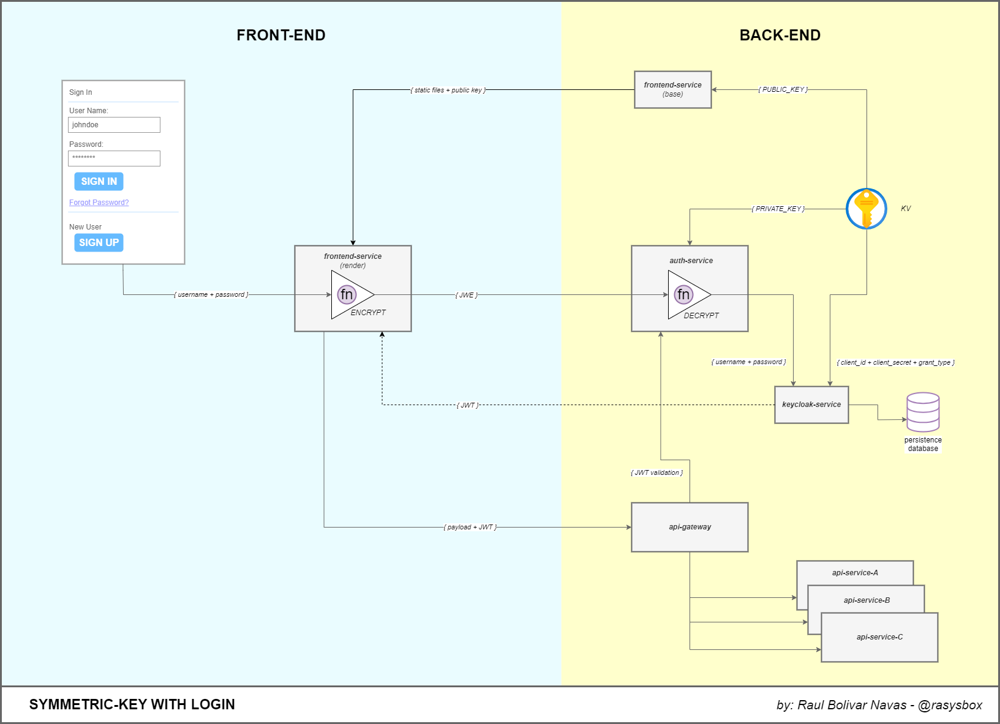

# Symmetric Encryption and Decryption

This is a simple symmetric encryption and decryption program written in JavaScript and Java. It uses the `cryptography` library to encrypt and decrypt messages using the Fernet symmetric encryption scheme.

The flow of the data is as follows:

### Example

With the following flow of data we can encrypt and decrypt a message using a symmetric keys for login:

### Author

- [Raul Bolivar Navas](https://github.com/raulrobinson/symmetric-keys)

### License

This project is licensed under the MIT License - see the [LICENSE](LICENSE) file for details.